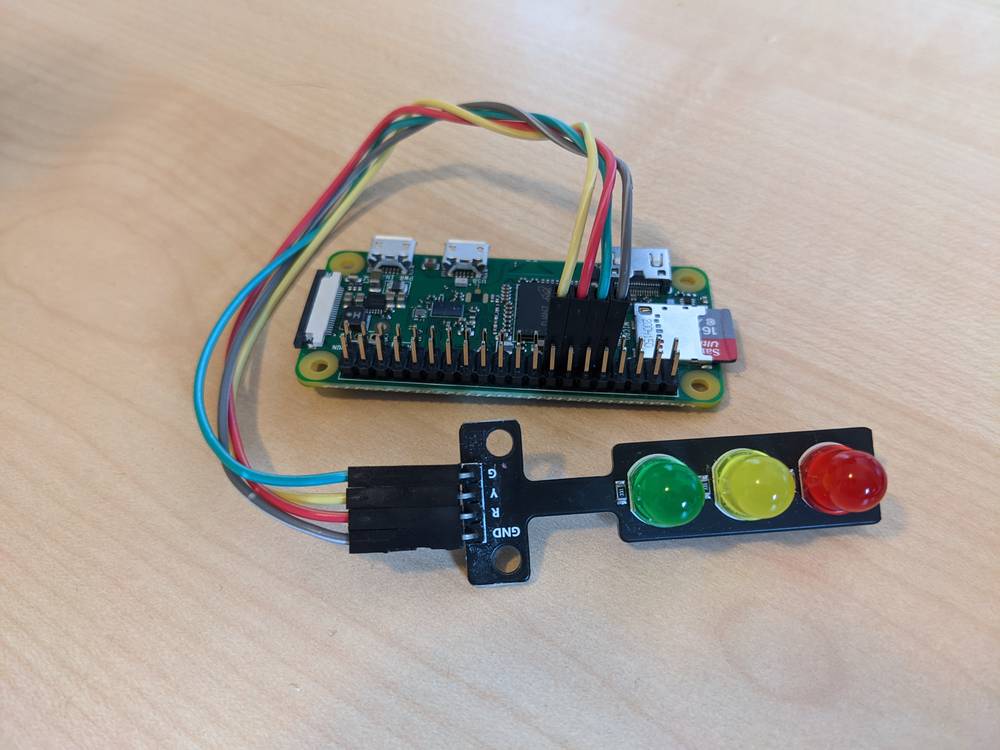

# Traffic Light - Jenkins Builds

A lightweight traffic light build indicator for Jenkins.

## Requirements

* Raspberry Pi (e.g. RPI Zero W) with
    * python3
    * pip3
* Three LEDs as traffic light
* Jenkins Project you want to watch :)

## Setup

* Run `$ cp config-example.py config.py` to create local config file
* Run `$ pip3 install -r requirements.txt` to install dependencies
* Open `config.py` and configure your LEDs and Jenkins Setup
    * Note: this project uses `GPIO.BCM` as RPI Pinout
* Run `python3 main.py` to start watching your Jenkins builds
* Run `[/scripts] $ sh install.sh` to create systemd service for traffic light
    * This will automatically start the project on reboot
    * You might need change your `WorkingDirectory` in `/scripts/traffic-light.service`
